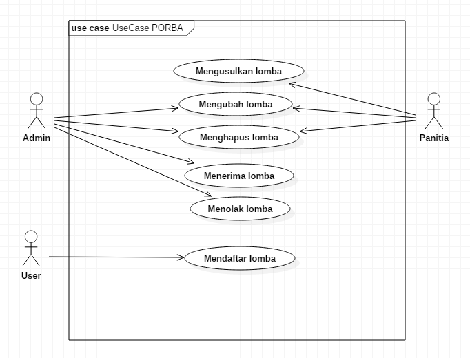
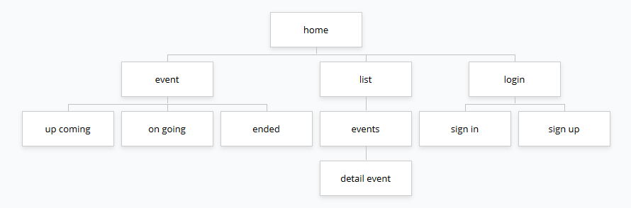
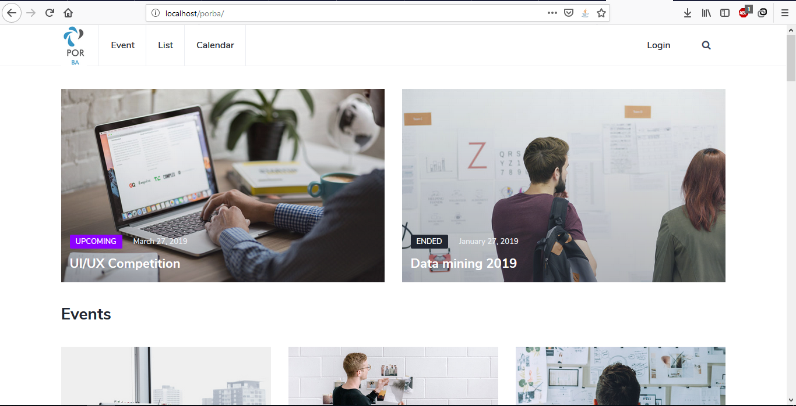
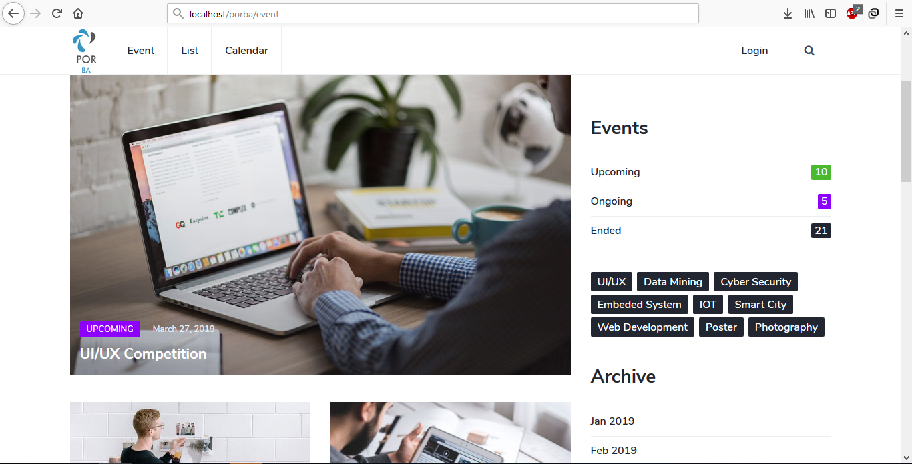
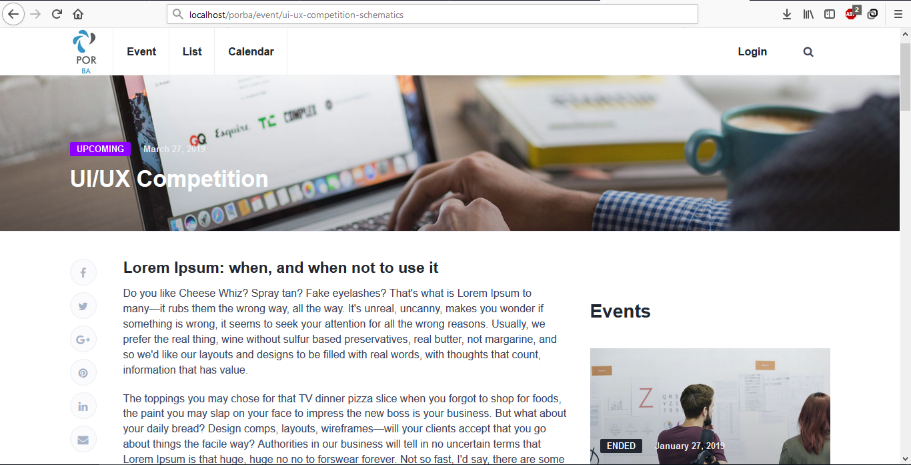

# Pemrograman Berbasis Kerangka Kerja

## Kriteria Aplikasi

1. Memberikan solusi terhadap problem tertentu
2. Menggunakan Spring Framework
3. Terdapat komponen REST-API untuk digunakan oleh platform lain

## Anggota Kelompok

| Nama | NRP |
| :--- | :---:|
| Gusti Ngurah Satria Aryawan | 051115 4000 0066 |
| Pius Pambudi | 051115 4000 0069 |
| Nahda Fauziyah Zahra | 051115 4000 0141 |

## Nama Aplikasi
Aplikasi yang akan kami buat adalah <i>"Portal Informasi Lomba Informatika"</i>

## Deskripsi
- Analisis Aplikasi
    - Dibutuhkan portal untuk informasi tentang lomba yang berlangsung, khususmya perlombaan mengenai isu teknologi.
    - Portal dapat memberikan informasi lomba seperti deskripsi dari lomba tersebut, waktu lomba diadakan, institusi yang mengadakan lomba, serta hadiah dari perlombaan tersebut.
    - Portal juga dapat menampilkan notifikasi jika ada lomba baru atau lomba yang sedang berlangsung.

- Deskripsi Aplikasi
    - Terdapat sebuah halaman yang berisi daftar perlombaan yang sedang berlangsung atau akan berlangsung.
    - Berisi informasi-informasi terkait lomba tersebut.

## Use Case

- Daftar Aktor
    - Panita
        - Mengusulkan lomba
        - Mengubah lomba
        - Menghapus lomba
    - Admin
        - Menerima/menolak lomba
        - Mengubah lomba
        - Menghapus lomba
        - Menghapus account
    - User
        - Mendaftar lomba

- Daftar Fitur
    - Memuat daftar lomba
    - Detail lomba
    - List lomba beserta keterangannya (Upcoming/Ongoing/Ended)
    
## Sitemap Aplikasi

## Tampilan Web
- Home Page

- Event Page

- Detail Event Page
